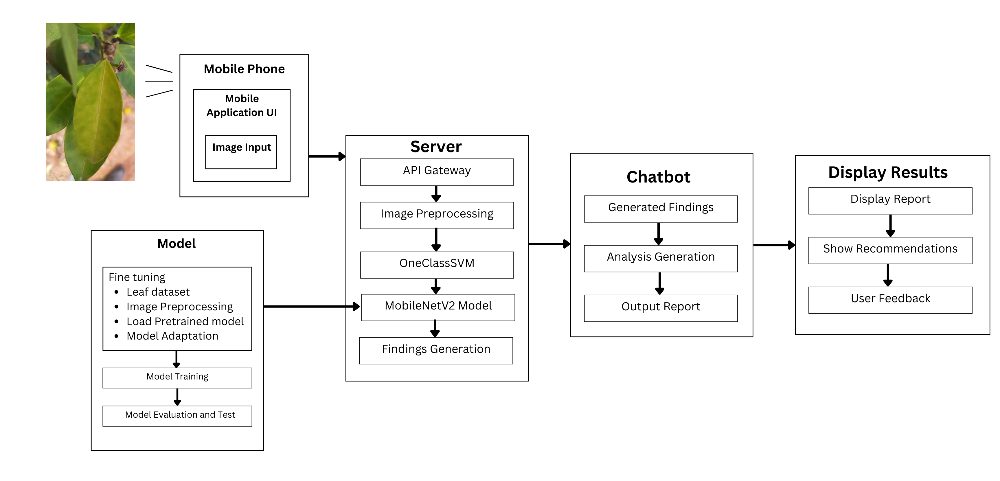
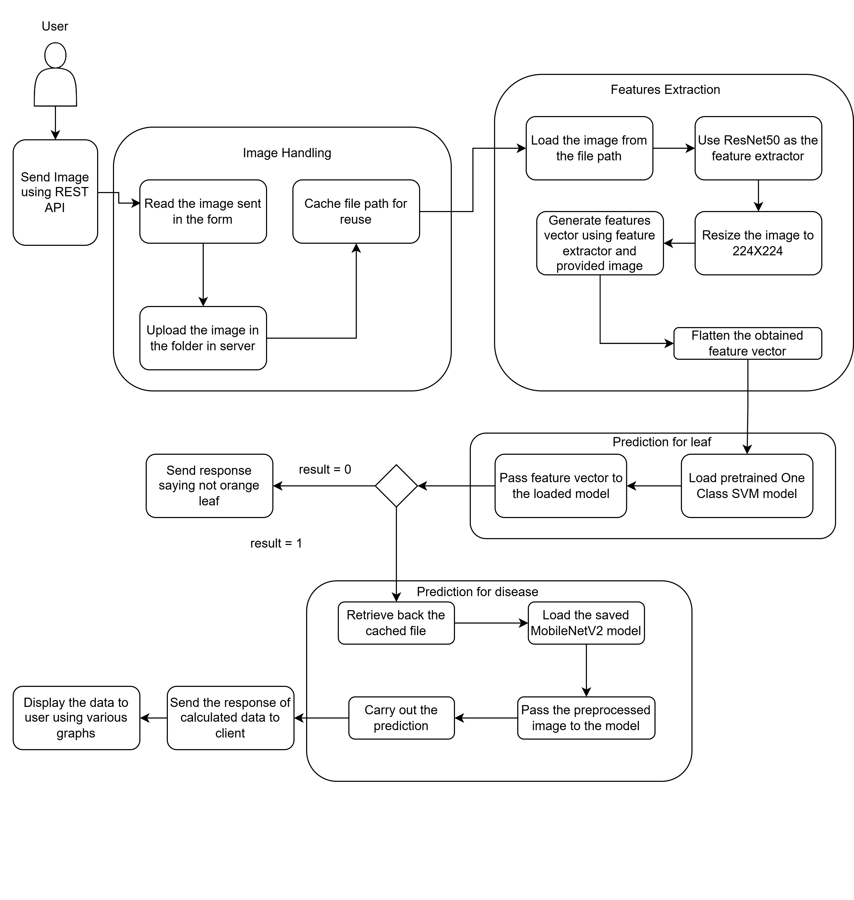

# 🟠 DEEP-CiDO: Detection and Early Prevention of Citrus Disease in Orange

**DEEP-CiDO** is an AI-powered system designed for the detection and early prevention of citrus diseases in orange plants using deep learning and retrieval-augmented generation (RAG) technologies. The system integrates image classification, intelligent chatbot support, and mobile accessibility to empower farmers and agricultural experts in disease monitoring and management.

Also known as **Detection and Prevention of Cirus Disease using Deep Learning**.

### Diseases Covered:
-  Blackspot
- Canker
- HLB
- Leaf Miner
- Sooty Mold

---
N.B: This is not a complete code of the project but rather a part of the complete code.
---

## 🧠 Project Overview

- **Title**: DEEP-CiDO (Detection and Early Prevention of Citrus Disease in Orange)
- **Domain**: Agriculture + Artificial Intelligence
- **Tech Stack**:
  - Backend: Django (Python)
  - Chatbot: Python (RAG-based)
  - Mobile App: Flutter
- **Deployment**: Hosted on Microsoft Azure (Subscription ended April 2025)

---

## 📌 Key Features

- 📷 **Image-based Disease Detection** using deep learning (ResNet50, MobileNetV2, SVM)
- 🤖 **RAG-based Chatbot** for dynamic question answering from expert-verified knowledge
- 📊 **Graphical Reports** with recommendations and feedback system
- 📱 **Cross-platform Mobile App** for field usage and real-time results

---

## 📂 Dataset

- **Source**: Custom dataset collected from orange farms in Dhulikhel, Nepal
- **Format**: Labeled leaf images with disease and health categories
- **Knowledge Base**: Collected from:
  - Warm Temperature Horticulture Center
  - Government Agricultural Extension Offices
  - Verified experts (not all data is shown here)

---

## 🔧 System Architecture

### 📱 Mobile Application
- Developed in Flutter
- Allows users to capture or upload leaf images
- Sends the image to the Django backend via REST API

### 🖥️ Backend Server
- Django-based API Gateway
- Handles image processing and caching
- Performs:
  - **Leaf Verification** using One-Class SVM
  - **Disease Detection** using MobileNetV2

### 🧠 Deep Learning Models
- **ResNet50**: Used for feature extraction
- **One-Class SVM**: Classifies if the image is a valid orange leaf
- **MobileNetV2**: Identifies the type of citrus disease

### 💬 Chatbot System
- Built in Python using Retrieval-Augmented Generation (RAG)
- Dynamically answers farmer queries based on agricultural KB
- Integrates with backend findings to provide detailed insights

---

## 🔄 Workflow

1. User sends a leaf image from the mobile app.
2. Server verifies if it is an orange leaf using ResNet50 + One-Class SVM.
3. If valid, the image is passed to MobileNetV2 for disease classification.
4. Results are stored and forwarded to the chatbot.
5. The chatbot generates a full report, recommendations, and feedback form.

---

## 🚀 API Usage

### 🔹 Endpoint: `POST /api/check-leaf`
- **Description**: Upload a leaf image
- **Request**: Multipart form-data with image file
- **Response**:
  - JSON result with disease type
  - Chatbot-generated recommendation

### 🔹 Endpoint: `POST /check_disease_api`
- **Description**: From check leaf to Check disease
- **Response**: JSON reposne of confidence of disease prediction

### 🔹 Endpoint: `POST /chatbotresponse`
- **Description**: Fetch the chatbot's reply to user's question
- **Response**: Jsom result with bot's response

---

## 📊 Output Examples

- Disease type (e.g., Citrus Canker, Greening)
- Severity level
- Graphs for farm-wide disease distribution
- Chatbot-generated suggestions (e.g., pesticides, pruning)

---

## 👥 Contributors

- Dataset & Field Work: Collected from Dhulikhel farms
- Knowledge Collection: Agricultural Departments and Experts
- Development Team: Final year students, Computer Engineering

---

## 🛑 Disclaimer

This project was developed for academic purposes. The Azure cloud deployment has expired as of **April 2025** and is no longer active.

---

## 📷 Project Block Diagrams
Project Block Diagram:

Server Block Diagram

---

Author: 
&nbsp;&nbsp;&nbsp;&nbsp;- [Prahad Acharya](https://github.com/Godfatherleop)  
&nbsp;&nbsp;&nbsp;&nbsp;- [Rijan Pokhrel]()  
&nbsp;&nbsp;&nbsp;&nbsp;- [Sakar Dahal](https://github.com/SakarDahal04)  
&nbsp;&nbsp;&nbsp;&nbsp;- [Vishal Sigdel](https://github.com/Page-Vishal)  
